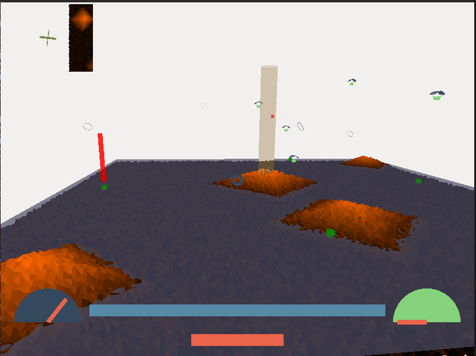
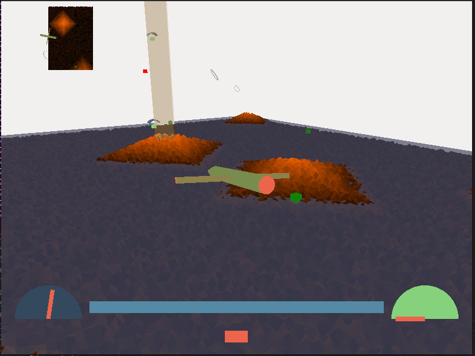

# INSTALL AND RUN
```bash
sudo apt install libglew-dev libglfw3-dev libglm-dev cmake pkg-config
sudo chmod a+x run.sh
./run.sh
```

# FEATURE HIGHLIGHT
* live minimap  
* realtime regenerating levels  

# SCREEN SHOTS




# CONTROLS
W            -> pitch up  
S            -> pitch down  
D            -> yaw right  
A            -> yaw left  
E            -> roll right  
Q            -> roll left  
SPACE        -> accelerate in the direction facing  
  
1             -> follow cam  
2             -> front cam  
3             -> top view  
4             -> tower view  
5             -> helicopter cam  
mouse         -> move cam in helicopter cam  
scroll        -> zoom in helicopter cam  
  
M             -> missile  
N             -> Bombs  

L             -> Loop-the-loop  
B             -> Barrel roll  
